# Mario Vidal Domínguez - @Mariovido

## Stats

  
  

## Contact

- 📧 E-Mail: [mario.vidaldom@gmail.com](mailto:mario.vidaldom@gmail.com)

## FAQ

### Studies

- 🌐 European Master in Software Engineering [@UPM](https://www.upm.es/)
- 📡 Telecommunications Engineering [@UPV](https://www.upv.es/)

### Experience

- [Current] 💻 Software Enginer [@Datadog](https://www.datadoghq.com/)
- [Current] 🎓 Associate Professor [@ICAI Comillas](https://www.comillas.edu/icai/)
- ✈️ Software Engineer [@eDreams ODIGEO](https://www.edreams.com/)
- 🖥 Back End Developer [@Minsait](https://www.minsait.com/)
- 👨🏻‍💼 Consultant [@KPMG](https://kpmg.com/)
